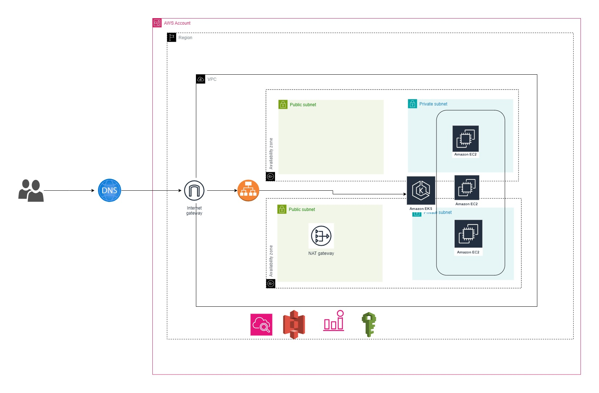
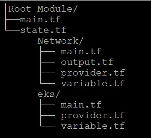

# Building AWS Elastic Kubernetes Service (EKS) with Terraform
<h2>Project Overview</h2>
<p>The project revolves around leveraging Amazon Elastic Kubernetes Service (EKS) to streamline and optimize our containerized applications' deployment and management. EKS provides a reliable and scalable platform for running Kubernetes clusters, allowing us to efficiently orchestrate and manage containerized workloads.This project harnesses the power of Amazon EKS to build a resilient, scalable, and cost-effective platform for deploying and managing containerized applications in the cloud. EKS empowers us to innovate rapidly, deliver value to our customers, and drive business growth with modern cloud-native technologies.</p>



<h2>Pre-requisites</h2>
<p><b>Credentials:</b> Need AWS Configure
<p><b>S3 Bucket:</b> You need to have a S3 Bucket to store Terraform State Files</p>

<h2>Module Structure</h2>



<h2>Terraform Command</h2>

```terraform
For Terraform Root Module:

terraform init
terraform validate
terraform plan
terraform apply --auto-approve
```

